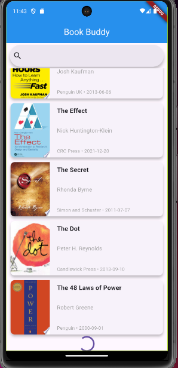
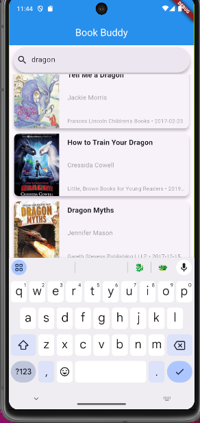

# BOOK BUDDY
Book Buddy is an application for Bibliophiles. It is built in flutter and utilises BLoC architecture for creating a maintainable and scalable codebase along with efficient state management. Further, Pagination reduces overhead for fetching data. Users may discover new books, learn more about them through their Description Pages or search for their favourites.<br>

## Architecture
The app has been divided into 2 layers:<br>
### 1.Presentaion Layer:
Contains Widgets and UI components, along with a sublayer of BLoC which handles any changes to the state of the UI.<br>
### 2.Data Layer: 
Contains all the logic for interaction with external service such as a public api or to your backend to fetch, send and process data.<br>
```
.
├── data
│   ├── api
│   │   └── book_api.dart
│   └── model
│       └── book.dart
├── main.dart
└── presentation
    ├── bloc
    │   ├── books_bloc.dart
    │   ├── books_event.dart
    │   └── books_state.dart
    ├── screens
    │   ├── description.dart
    │   └── main_screen.dart
    └── widgets
        └── book_tile.dart

```
## Setup
### Requirements:
Flutter:Version 3.x or later
Dart SDK Version: ^3.6.0
### Install:
1. Clone into the repository
```bash
git clone https://github.com/MS-githubaccnt/BookBuddy/
cd flutter_application_1
```
2. Get Dependencies
```bash
flutter pub get
```
3.Run the app
```bash
flutter run
```
4.To get an apk
```bash
flutter build apk --release
cd build/app/outputs/flutter-apk
```
### DEMO:
HomeScreen<br>
<br>
Description<br>
<br>
Pagination<br>
<br>
Search<br>
<br>

### BLoC Explanation:
The app utilises a single Bloc the BooksBloc for the State management.<br>
3 states have been used:
1. Books Loading : For progress indicator during loading.
2. Books Fetched: To handle addition of new books.
3. Books Error : For error handling.
<br>
2 events are used:<br>
1. Fetch: To fetch more books.
2. Search: To search for books.